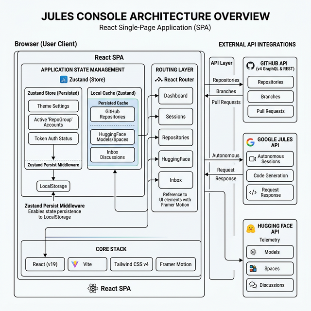

# Jules Console


> **⚠️ CAUTION**: This application provides direct management of GitHub repositories. **Deleting a repository within Jules Console is permanent and cannot be undone.** Use with extreme caution.

> **🚧 UNDER DEVELOPMENT**: This project is in active development. Features are being added and refined frequently, and **new features will be implemented** regularly. Please expect occasional breaking changes and experimental functionality.

A premium "Command Center" for orchestrating **Google Jules** autonomous coding sessions and managing **GitHub** repositories. Built with a focus on aesthetics, speed, and developer experience.




## 🚀 Features

-   **Autonomous Orchestration**: Create, monitor, and analyze Google Jules coding sessions with real-time timelines.
-   **Starred Repo Reviews**: A full curation system to review, note, and analyze your GitHub starred repositories.
-   **Deep GitHub Integration**: Manage branches, auto-generate descriptions, and link directly to VS Code.
-   **Multi-Account Support**: Switch between multiple Jules API environments seamlessly.
-   **Modern UI**: A premium, high-performance UI built with TailwindCSS v4 and Framer Motion.

> **For a full breakdown of every capability, see [FEATURES.md](./FEATURES.md).**

## 🛠️ Tech Stack

-   **Frontend**: React (v19), TypeScript, Vite.
-   **Styling**: TailwindCSS v4, Framer Motion (animations), Lucide React (icons).
-   **State**: React Hooks (Custom `useJules`, `useGithubRepos`).
-   **API**: Proxy-based architecture to handle CORS safely.

## 📦 Installation & Setup

1.  **Clone the repository**
    ```bash
    git clone https://github.com/kidahatsu/jules-console.git
    cd jules-console
    ```

2.  **Environment Configuration**
    Copy the example environment file and fill in your keys:
    ```bash
    cp .env.example .env
    ```
    
    Edit `.env` and add:
    -   `VITE_JULES_API_KEY`: Your Google Cloud API Key with Jules access.
    -   `VITE_GITHUB_TOKEN`: A GitHub Personal Access Token (Classic) with `repo` scope.
    -   `VITE_HF_TOKEN`: A Hugging Face User Access Token (for Model/Space telemetry).

3.  **Install Dependencies**
    ```bash
    npm install
    ```

4.  **Run Development Server**
    ```bash
    npm run dev
    ```
    Access the dashboard at `http://localhost:5173`.

## 🤝 Contributing

1.  Fork the repository.
2.  Create your feature branch (`git checkout -b feature/amazing-feature`).
3.  Commit your changes (`git commit -m 'Add some amazing feature'`).
4.  Push to the branch (`git push origin feature/amazing-feature`).
5.  Open a Pull Request.

## 📄 License

Distributed under the GNU Affero General Public License v3.0 (AGPLv3). See `LICENSE` for more information.
